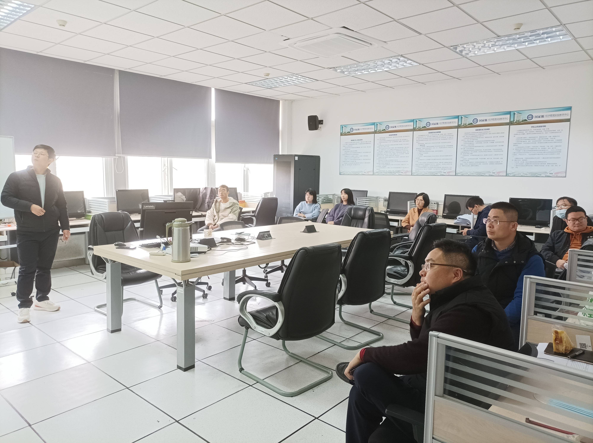

### 2021-2022学年第一学期
  
午餐会提供免费简餐，欢迎院内外师生及外院老师参加！<br>
  
日程：  
```{r,echo=FALSE}
z <- data.frame(
  date=c("2021-10-13","2021-11-17"),
  time=c("12:05-13:00pm","12:10-13:00pm"),
  room=c("Z1-408","Z1-408"),
  reporter=c("张雪凯","袁金建"),
  topic=c("童年随迁经历与劳动力市场表现","Short-sale Constraints and Cross-predictability : Evidence from Chinese Market"),
  stringsAsFactors = FALSE)
knitr::kable(z)
```
活动照片：<br>
```{r, out.height="75%", out.width="75%", echo=FALSE}

```
