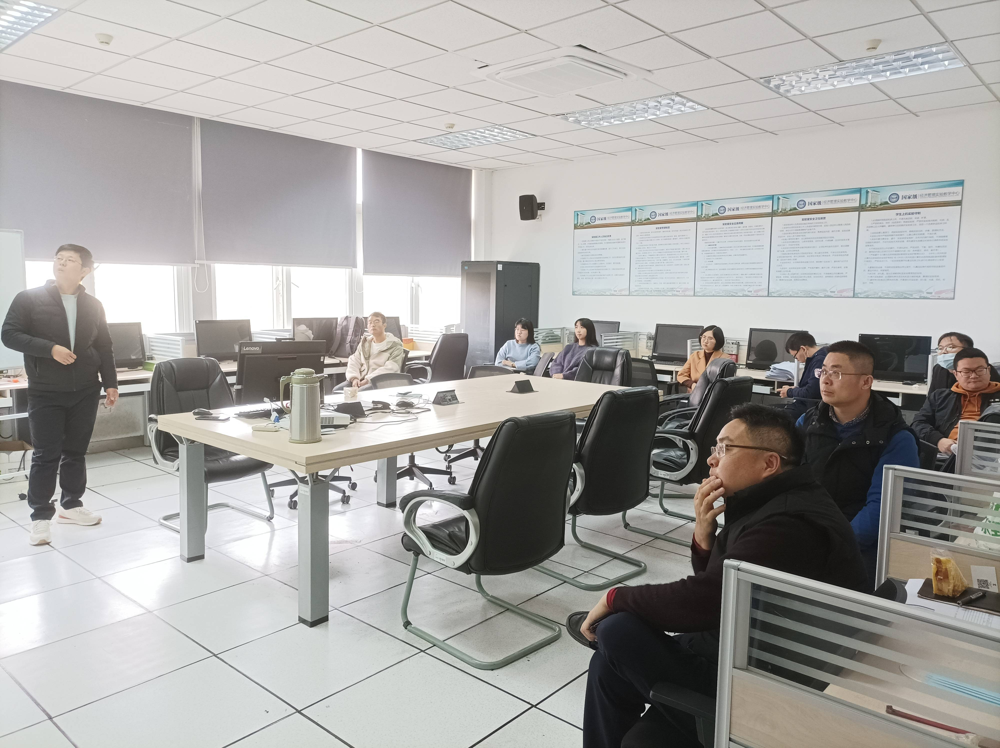

### 2021-2022学年第一学期
  
午餐会提供免费简餐，欢迎院内外师生及外院老师参加！<br>
  
日程：

| 时间 | 地点 | 报告人 | 报告题目 |
| ---- | ---- | ---- | -------- |
| 2021-10-13 12:05-13:00pm | Z1-408 |张雪凯 | 童年随迁经历与劳动力市场表现 |
| 2021-11-17 12:10-13:00pm | 公共财政中心 | 袁金建 | Short-sale Constraints and Cross-predictability : Evidence from Chinese Market |
| 2021-12-* 12:30-13:00pm | Z1-408 | 刘亮亮 | * |

活动照片：<br>
```{r, out.height="75%", out.width="75%", echo=FALSE}

```
